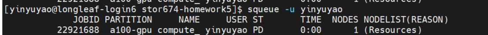

```{r setup, include=FALSE}
knitr::opts_chunk$set(echo = TRUE, eval = FALSE)
```

# Overview

This homework will test your knowledge of version control with Git/GitHub, containerization with Docker, and high-performance computing with Apptainer and Slurm. You will:

1. Answer conceptual questions about Git and GitHub
2. **Create a GitHub repository and version control your Docker image build process (with branching and merging)**
3. Build a Docker image for the Linux environment and push it to Docker Hub
4. Download and run the image on Longleaf using Apptainer and Slurm

**Note:** You may be working on macOS or Windows, but you'll be building Linux containers that will run on Longleaf's Linux HPC environment.

**Total Points: 100**

**Important:** You will need to submit:
- A PDF/HTML version of this completed Rmd file with your answers
- A link to your GitHub repository
- A link to your Docker Hub image
- Your Slurm job script
- Screenshot/output of your Slurm job completion

---

# Part 1: Git and GitHub Concepts (20 points)

## Question 1.1: Understanding Commits (5 points)

**a)** (3 points) What does a commit do in Git? Explain what information is stored in a commit.

**Answer:**

A Git commit records a snapshot of the repository at a point in time. A commit contains the root tree of the files and directories at that moment, and basic information such as author and the commit message.


**b)** (2 points) Why is it important to write descriptive commit messages? Provide an example of a good commit message and a bad commit message.

**Answer:**

Because we can tell why a change was made when debugging or reviewing history, so that in the future when my teammates or I can understand context quickly. A good message could be "Add CUDA-enabled Dockerfile for compute_bench benchmark" and a bad message could be "more changes added".


## Question 1.2: Branching in Git (10 points)

**a)** (5 points) Explain how branching works in Git. What happens when you create a new branch? What command would you use to create a new branch called `feature-analysis` and switch to it?

**Answer:**

A branch in Git is just a movable pointer (a named reference) to a commit. When you create a new branch, Git does not duplicate files; it just creates a new ref pointing to the current commit. As you commit on that branch, that pointer moves forward. We use "git switch -c feature-analysis" to create and immediately switch to a branch called feature-analysis.


**b)** (5 points) Git branching is often described as "super lightweight" compared to other version control systems. Explain why Git branching is lightweight. (Hint: Think about how Git stores branches and what happens under the hood when you create a branch.)

**Answer:**

Because a branch is literally just a tiny file under .git/refs/heads/ storing a commit hash, and branches share the same underlying objects (file blobs, trees, commits); nothing is copied when you branch. In addition, all operations are local, so creating or switching branches is just O(1).


## Question 1.3: Merging Branches (5 points)

**a)** (3 points) What is the purpose of merging branches? Describe the steps you would take to merge a branch called `feature-analysis` into the `main` branch.

**Answer:**

Merging combines the histories of two branches so that the target branch includes the commits from both.
step 1: Switch to main using "git switch main"
step 2: Update from remote "git pull"
step 3: Merge feature-analysis into main "git merge feature-analysis"
step 4: git commit

**b)** (2 points) What is a merge conflict and when does it occur?

**Answer:**

A merge conflict happens when Git can’t automatically reconcile differences between branches, such as the same lines in the same file were edited differently in each branch. 


---

# Part 2: Docker Image Creation and Deployment with Version Control (50 points)

In this section, you will create a Docker image that can run the `compute_bench.py` script (which you used in Homework 2), which benchmarks CPU/GPU performance using PyTorch. **You will version control the entire process using Git and GitHub, practicing branching and merging workflows.**

**Important Note on Operating Systems:** You may be working on macOS or Windows, but Docker containers run Linux by default. You will be building a **Linux-based container** that will run on Longleaf (which is also Linux). Docker handles the cross-platform compatibility automatically, so your Linux container built on macOS/Windows will work seamlessly on Longleaf's Linux environment.

## Question 2.0: GitHub Repository Setup (5 points)

Before building your Docker image, you will set up version control for your project.

**a)** (1 points) Create a new GitHub repository called `stor674-homework5` (or similar name). Initialize it with a README. Provide the GitHub repository URL.

**GitHub Repository URL:**

https://github.com/yinyu-yao/stor674-homework5


**b)** (2 points) Clone the repository to your local machine, add the provided files (`compute_bench.py`, this `Homework5.Rmd`), and make your initial commit. What commands did you use?

**Answer:**

```bash
git clone https://github.com/yinyu-yao/stor674-homework5.git
cd stor674-homework5
copy ..\compute_bench.py .
copy ..\Homework5.Rmd .
git add compute_bench.py Homework5.Rmd
git commit -m "Add compute_bench script and Homework5 Rmd template"

```

**c)** (2 points) Create a new branch called `docker-build` where you will develop your Dockerfile. What command did you use? Why is it good practice to use a separate branch for development instead of working directly on `main`?

**Answer:**

```bash
git switch -c docker-build
git push -u origin docker-build
```

**Explanation:**

<!-- Why use a separate branch? -->
I'm using a separate branch so you don’t break main while you experiment with the Dockerfile.

## Question 2.1: Understanding compute_bench.py (5 points)

**a)** (3 points) Read the `compute_bench.py` script. What does this script do? What is its main purpose?

**Answer:**

The script benchmarks how long it takes to generate and process large random tensors on CPU and GPU using PyTorch, and then saves a small random sample to disk. The main purpose is to compare CPU vs GPU performance for a simple vectorized operation in PyTorch and to demonstrate generating and saving random data.


**b)** (2 points) What Python packages does `compute_bench.py` require?

**Answer:**

'torch' and 'time'.


## Question 2.2: Create a Dockerfile (10 points)

Create a Dockerfile that:
- Uses an appropriate **Linux-based** base image with Python 3.9 or later
- Installs the required Python packages (PyTorch with CUDA support for GPU computing)
- Copies `compute_bench.py` into the container
- Sets the default command to run the script

**Important Considerations:**

- **Operating System**: Even if you're on macOS or Windows, Docker will build a Linux container. Use Linux base images (e.g., `python:3.9-slim` is based on Debian Linux).

- **CUDA Support**: Longleaf has NVIDIA GPUs. To enable GPU support in your container:
  - Option 1: Use official PyTorch image with CUDA: `pytorch/pytorch:2.0.0-cuda11.7-cudnn8-runtime`
  - Option 2: Install PyTorch with CUDA support: `pip install torch torchvision --index-url https://download.pytorch.org/whl/cu118`
  - Note: The container itself doesn't need NVIDIA drivers (Longleaf provides those), but PyTorch needs to be CUDA-aware.

- **Testing Locally**: If your computer doesn't have an NVIDIA GPU, the container will still build and run (it will just use CPU). On Longleaf with GPU nodes, it will automatically detect and use the GPU.

**Instructions:**

1. Make sure you're on the `docker-build` branch
2. Create a file named `Dockerfile` in your repository
3. Write the Dockerfile content below:

```dockerfile
# Paste your Dockerfile content here
# CUDA-enabled PyTorch image (Linux base)
FROM pytorch/pytorch:2.0.0-cuda11.7-cudnn8-runtime

# Set working directory inside the container
WORKDIR /app

# Copy the benchmark script into the container
COPY compute_bench.py /app/compute_bench.py

# upgrade pip (no extra packages needed for this script)
RUN pip install --no-cache-dir --upgrade pip

# run the benchmark
CMD ["python", "compute_bench.py"]


```

**Grading Criteria:**
- Appropriate Linux base image selection (2 points)
- CUDA-enabled PyTorch installation (4 points)
- Proper file copying (2 points)
- Correct CMD or ENTRYPOINT (2 points)

## Question 2.3: Build and Test Docker Image (10 points)

**a)** (3 points) What command did you use to build your Docker image? Include the full command and explain each part.

**Answer:**

```bash
# Your command here
docker build -t compute-bench:cuda11.7 .
```

**Explanation:**

<!-- Explain each part of your command -->
'docker build' tells Docker to build an image from the Dockerfile, and '-t compute-bench:cuda11.7' tells the image a name is 'compute-bench' and a tag 'cuda11.7' so we can refer to it later.


**b)** (4 points) What command did you use to run your Docker image locally to test it? Include the output you received.

**Answer:**

```bash
# Your command here
docker run --rm compute-bench:cuda11.7
```

**Output:**

```
# Paste the output here
No GPU available, running on CPU only

CPU Computations:
Time for 10,000,000 elements: 0.0696 seconds
Time for 100,000,000 elements: 0.6305 seconds

Small sample of 10 random numbers:
tensor([-0.1326, -1.5500,  1.1859,  1.5597,  0.7008, -0.4011, -1.1648,  0.1153,
        -0.3273, -0.3363])

Saved data to mydata.pt


```

**c)** (3 points) Were there any issues you encountered during the build or test? How did you resolve them?

**Answer:**

<!-- Write your answer here -->
At first, docker wasn’t recognized, so I had to install Docker Desktop. After installation, I got an error that the client couldn’t connect to docker_engine, which I fixed by starting Docker Desktop so the daemon was running. Then the build failed because it couldn’t read Dockerfile; this was due to the Dockerfile not being saved correctly in the project directory. After creating/saving Dockerfile in stor674-homework5 with the correct name, the image built successfully and docker run produced the expected output.

## Question 2.4: Version Control Your Docker Build (10 points)

Now that you have a working Dockerfile, let's commit it and merge it into the main branch.

**a)** (3 points) On your `docker-build` branch, add and commit your Dockerfile with a descriptive commit message. What commands did you use?

**Answer:**

```bash
# Commands to add and commit Dockerfile


```

**b)** (4 points) Switch to the `main` branch and merge the `docker-build` branch into it. What commands did you use? Paste the merge message or output.

**Answer:**

```bash
# Commands to switch branch and merge
git add Dockerfile
git commit -m "Add CUDA-enabled Dockerfile for compute_bench benchmark"

```

**Merge Output:**

```
# Paste merge output here
Updating 5efd643..1c3b52a
Fast-forward
 Dockerfile | 16 ++++++++++++++++
 1 file changed, 16 insertions(+)
 create mode 100644 Dockerfile

```

**c)** (3 points) Push your changes to GitHub. Verify that your repository now contains the Dockerfile on the main branch. What command did you use to push?

**Answer:**

```bash
# Command to push to GitHub
git push origin main

```

**Verification:** Visit your GitHub repository in a web browser and confirm the Dockerfile is visible. ✓


## Question 2.5: Push to Docker Hub (10 points)

**a)** (3 points) Create a Docker Hub account (if you don't have one) and provide your Docker Hub username.

**Docker Hub Username:**

<!-- Your username here -->
yinyuyao

**b)** (4 points) Tag your image appropriately and push it to Docker Hub. What commands did you use?

**Answer:**

```bash
# Commands you used
docker tag compute-bench:cuda11.7 yinyuyao/compute-bench:cuda11.7

docker login
docker push yinyuyao/compute-bench:cuda11.7


```

**c)** (3 points) Provide the full Docker Hub image URL/name that others can use to pull your image.

**Image URL:**

```
# Format: username/imagename:tag
yinyuyao/compute-bench:cuda11.7
```

---

# Part 3: Apptainer and Slurm on Longleaf (30 points)

In this section, you will download your Docker image using Apptainer on UNC's Longleaf cluster and submit a job using Slurm. Remember: your Linux container built on macOS/Windows will run seamlessly on Longleaf's Linux environment.

## Question 3.1: Understanding Apptainer (5 points)

**a)** (3 points) What is Apptainer (formerly Singularity) and why is it used on HPC systems instead of Docker?

**Answer:**

<!-- Write your answer here -->
Apptainer is a container runtime designed specifically for HPC clusters. It lets you run container images, including Docker images, as a regular user, without needing a root‑privileged daemon.HPC centers use Apptainer instead of Docker because: Docker requires a long‑running root 'dockerd', which is a security risk on shared multi‑user systems, and Apptainer runs containers with my normal user ID, integrates cleanly with shared filesystems and schedulers such as SLURM, and doesn’t need privileged services. So Apptainer gives most of the benefits of Docker images, in a security model HPC admins will actually allow.

**b)** (2 points) What does "Bring Your Own Environment" (BYOE) mean in the context of HPC and containers?

**Answer:**

<!-- Write your answer here -->
“Bring Your Own Environment” means you package your entire software stack in a container image and bring that image to the cluster. On Longleaf, you can build the environment with Docker on your laptop, then run the same environment via Apptainer. The cluster just provides CPU/GPU and file systems; you provide a self‑contained, consistent runtime. That makes jobs reproducible regardless of which node or system runs them.

## Question 3.2: Convert Docker Image to Apptainer (10 points)

**a)** (5 points) Log into Longleaf and use Apptainer to pull your Docker image from Docker Hub. What command did you use?

**Answer:**

```bash
# Command to pull/convert Docker image to Apptainer
ssh yinyuyao@longleaf.unc.edu
git clone https://github.com/yinyu-yao/stor674-homework5.git
cd stor674-homework5
module load apptainer
apptainer pull compute-bench.sif docker://yinyuyao/compute-bench:cuda11.7
```

**b)** (3 points) What is the name of the Apptainer image file (.sif) that was created?

**Answer:**

```
# Filename here
compute-bench.sif
```

**c)** (2 points) Test your Apptainer image interactively. What command did you use to run it?

**Answer:**

```bash
# Command to run Apptainer image

apptainer run compute-bench.sif
```

## Question 3.3: Create Slurm Job Script (12 points)

Create a Slurm job script that runs your containerized `compute_bench.py` using Apptainer.

**Hint:** If you want to test with GPU support on Longleaf, you'll need to:
- Request a GPU partition (e.g., `#SBATCH -p gpu`)
- Request GPU resources (e.g., `#SBATCH --gres=gpu:1`)
- Your CUDA-enabled PyTorch in the container will automatically use the GPU!

**Instructions:**

1. Create a file named `run_compute_bench.sh` in your GitHub repository
2. Include appropriate Slurm directives (partition, time, memory, etc.)
3. Load necessary modules (if needed)
4. Run the Apptainer container

**Your Slurm Script:**
I first created 'run_compute_bench.sh' by using command 'nano run_compute_bench.sh'.
```bash
#!/bin/bash

# Paste your Slurm script here
#!/bin/bash

#SBATCH --job-name=compute_bench
#SBATCH --output=compute_bench_%j.out
#SBATCH --error=compute_bench_%j.err
#SBATCH -n 1
#SBATCH --cpus-per-task=12
#SBATCH --mem=20g
#SBATCH -t 02:00:00
#SBATCH -p a100-gpu
#SBATCH --qos=gpu_access
#SBATCH --gres=gpu:1

module purge
module load apptainer

echo "Job started on $(date)"
echo "Running on host: $(hostname)"
echo "Working directory: $(pwd)"

SIF_IMAGE="$PWD/compute-bench.sif"

# Run the container with GPU support exposed
apptainer run --nv "$SIF_IMAGE"

echo "Job finished on $(date)"


```

**Grading Criteria:**
- Appropriate Slurm directives (#SBATCH) (4 points)
- Correct Apptainer run command (6 points)
- Output redirection and job organization (2 points)

## Question 3.4: Submit, Verify, and Version Control (3 points)

**a)** (1 point) What command did you use to submit your job to Slurm?

**Answer:**

```bash
# Command here
sbatch run_compute_bench.sh
```

**b)** (2 points) Provide the output of your job. Paste the contents of your Slurm output file (e.g., `slurm-jobid.out`). Also, add your Slurm script (`run_compute_bench.sh`) to your GitHub repository and push it.

**Job Output:**

```
# Paste your job output here
Job started on Fri Nov 28 07:50:51 PM EST 2025
Running on host: g0302.ll.unc.edu
Working directory: /nas/longleaf/home/yinyuyao/stor674-homework5
GPU available: Tesla V100-SXM2-16GB

CPU Computations:
Time for 10,000,000 elements: 0.2309 seconds
Time for 100,000,000 elements: 1.6072 seconds

GPU Computations:
Time for 10,000,000 elements: 5.2654 seconds
Time for 100,000,000 elements: 0.0025 seconds

Small sample of 10 random numbers:
tensor([ 0.3367,  0.1288,  0.2345,  0.2303, -1.1229, -0.1863,  2.2082, -0.6380,
         0.4617,  0.2674])

Saved data to mydata.pt
Job finished on Fri Nov 28 07:51:05 PM EST 2025


```

**GitHub Verification:** ✓ Pushed `run_compute_bench.sh` to repository

**c)** (BONUS: +2 points) Include a screenshot showing your job in the Slurm queue or completed job information using `squeue` or `sacct`. Also show that your job successfully utilized a GPU (if you requested one).

---

# Part 4: Reflection and Best Practices (Optional - Extra Credit: 5 points)

**Question 4.1:** Reflect on the workflow you just completed (Git → Docker → HPC). How does this approach improve reproducibility in computational research? What are some advantages and potential challenges?

**Answer:**

<!-- Write your answer here -->
The Git → Docker → HPC workflow improves reproducibility by version-controlling both the code and the environment, then running that exact environment on the cluster. Git records every change to the benchmark script, Dockerfile, and Slurm script, so I can always go back to the commit that produced a given result. Docker turns that commit into a fixed Linux image with a specific Python, PyTorch, and CUDA stack, and Apptainer lets Longleaf run that image safely without root, while Slurm documents how many CPUs/GPUs and how much memory the job used. This approach makes it much easier for me or someone else to rerun the same experiment later or on a different machine, but it also adds overhead: I had to debug Docker installation, Apptainer pulls, partition/QOS settings, and Slurm queue behavior just to run a simple benchmark. In practice, the workflow trades some initial complexity for much stronger guarantees that computational results are portable, auditable, and repeatable.

---

# Submission Checklist

Before submitting, make sure you have:

- [✓] Completed all questions in Part 1 (Git/GitHub concepts)
- [✓] **Created a GitHub repository with all your project files**
- [✓] **Practiced branching and merging in your Git workflow**
- [✓] Created a Dockerfile with CUDA support for GPU computing
- [✓] Built and tested your Docker image locally (Linux container on macOS/Windows)
- [✓] Pushed your image to Docker Hub
- [✓] Provided your Docker Hub image URL
- [✓] Created a Slurm job script
- [✓] Successfully ran your job on Longleaf
- [✓] **Pushed all files (Dockerfile, Slurm script, completed Rmd) to GitHub**
- [✓] Included all output and screenshots
- [✓] Compiled this Rmd file to HTML or PDF

**Submission Instructions:**

1. **Ensure your GitHub repository contains:**
   - `Dockerfile`
   - `compute_bench.py`
   - `run_compute_bench.sh` (Slurm script)
   - `Homework5.Rmd` (completed)
   - Evidence of branching/merging in commit history
   
2. Submit the knitted HTML/PDF file on Canvas
3. **Submit the link to your GitHub repository on Canvas (REQUIRED)**
4. Submit the link to your Docker Hub image on Canvas

---

# Grading Rubric

| Section | Points |
|---------|--------|
| Part 1: Git and GitHub Concepts | 20 |
| Part 2: Docker with Version Control (includes branching/merging) | 50 |
| Part 3: Apptainer and Slurm on Longleaf | 30 |
| **Total** | **100** |
| Extra Credit (Part 4: Reflection) | +5 |
| Extra Credit (Part 3.4c: GPU screenshot) | +2 |
| **Maximum Possible** | **107** |

---

# Resources

- [Git Branching Documentation](https://git-scm.com/book/en/v2/Git-Branching-Branches-in-a-Nutshell)
- [Docker Hub](https://hub.docker.com/)
- [Apptainer Documentation](https://apptainer.org/docs/)
- [Longleaf Documentation](https://help.rc.unc.edu/longleaf-cluster/)
- Course lecture materials on GitHub, Docker, and Apptainer

---

**Good luck!**

